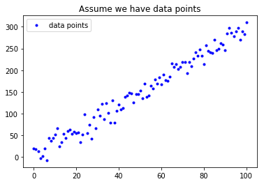
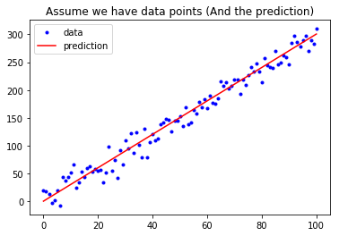

## 練習時間
#### 請寫一個函式用來計算 Mean Square Error
$ MSE = \frac{1}{n}\sum_{i=1}^{n}{(Y_i - \hat{Y}_i)^2} $

### Hint: [如何取平方](https://googoodesign.gitbooks.io/-ezpython/unit-1.html)

# [作業目標]
- 仿造範例的MAE函數, 自己寫一個MSE函數(參考上面公式)

# [作業重點]
- 注意程式的縮排
- 是否能將數學公式, 轉換為 Python 的函式組合? (In[2], Out[2])

# [作業1_ANS]


```python
# 載入基礎套件與代稱
import numpy as np
import matplotlib.pyplot as plt
```


```python
def mean_absolute_error(y, yp):
    """
    計算 MAE
    Args:
        - y: 實際值
        - yp: 預測值
    Return:
        - mae: MAE
    """
    mae = MAE = sum(abs(y - yp)) / len(y)
    return mae

# 定義 mean_squared_error 這個函數, 計算並傳回 MSE
def mean_squared_error(y, yp):
    """
    計算 MSE
    Args:
        - y:  實際值
        - yp: 預測值
    Return:
        - mse: MSE
    """
    mse = MSE = sum((y - yp)**2) / len(y)
    return mse
```


```python
# 與範例相同, 不另外解說
w = 3
b = 0.5
x_lin = np.linspace(0, 100, 101)
y = (x_lin + np.random.randn(101) * 5) * w + b

plt.plot(x_lin, y, 'b.', label = 'data points')
plt.title("Assume we have data points")
plt.legend(loc = 2)
plt.show()
```





```python
# 與範例相同, 不另外解說
y_hat = x_lin * w + b
plt.plot(x_lin, y, 'b.', label = 'data')
plt.plot(x_lin, y_hat, 'r-', label = 'prediction')
plt.title("Assume we have data points (And the prediction)")
plt.legend(loc = 2)
plt.show()
```





```python
# 執行 Function, 確認有沒有正常執行
MSE = mean_squared_error(y, y_hat)
MAE = mean_absolute_error(y, y_hat)
print("The Mean squared error is %.3f" % (MSE))
print("The Mean absolute error is %.3f" % (MAE))
```

    The Mean squared error is 217.992
    The Mean absolute error is 12.088
    

# [作業2]

請上 Kaggle, 在 Competitions 或 Dataset 中找一組競賽或資料並寫下：

1. 你選的這組資料為何重要

2. 資料從何而來 (tips: 譬如提供者是誰、以什麼方式蒐集)

3. 蒐集而來的資料型態為何

4. 這組資料想解決的問題如何評估

# [作業3]

想像你經營一個自由載客車隊，你希望能透過數據分析以提升業績，請你思考並描述你如何規劃整體的分析/解決方案：

1. 核心問題為何 (tips：如何定義 「提升業績 & 你的假設」)

2. 資料從何而來 (tips：哪些資料可能會對你想問的問題產生影響 & 資料如何蒐集)

3. 蒐集而來的資料型態為何

4. 你要回答的問題，其如何評估 (tips：你的假設如何驗證)

## [作業2_ANS]
1. 我選擇ETF股票作為數據(US Stocks & ETFs - Tickers, Company Info, Logos)，因為ETF相對個股不容易受到外資所控制，可以當作存股標的
2. Kaggle:https://www.kaggle.com/lp187q/ndxt-index-until-jan-202018
數據來自Yahoo的財務網站
3. 資料型態 
股價開收高低以及日期
4. 想要證明指數的波動型與ETF成長方式是否有關連性
而數據只有日期可以作為一種判斷的依據，為何會影響股價的波動，因為每個時間點都會有一些新聞或消息來影響整體股價的走勢

## [作業3_ANS]
1. 時間、車輛總數、載客技術、車上設備、乘車品質
若載客技術可以產生一整套遊山玩水的行程路線，可以吸引一些觀光客或是朋友相聚的包車選擇，搭配不同時間點有不同的行程計畫，或是以客製化的方式，
提供消費者做選擇。若是像uber一樣，車子是由司機提供，就只需要增加總人數，在事後做調整就可以應付各種狀況。設備和品質都是需要經過認證跟訓練。
2. 可以找集團式的車隊進行溝通，看能否取得資料並協助他們做商業上的優化
3.  時間:查看每一個時間點有多少為載客的車輛(Numeric) 
    車輛總數:Numeric 
    載客技術:以Level做區分(1-5) 
    車上設備:以Level做區分(1-5) 
    乘車品質:以Level做區分(1-5)
4. 以Uber為例，可以用app請乘客做問卷回饋
